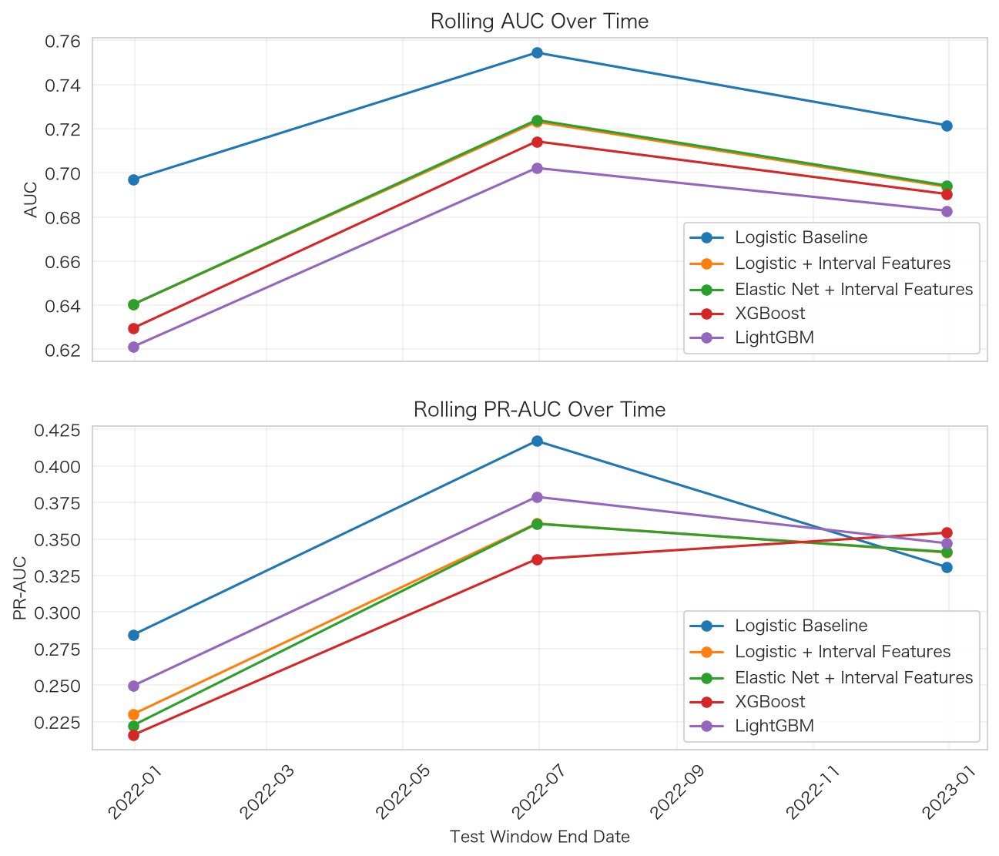
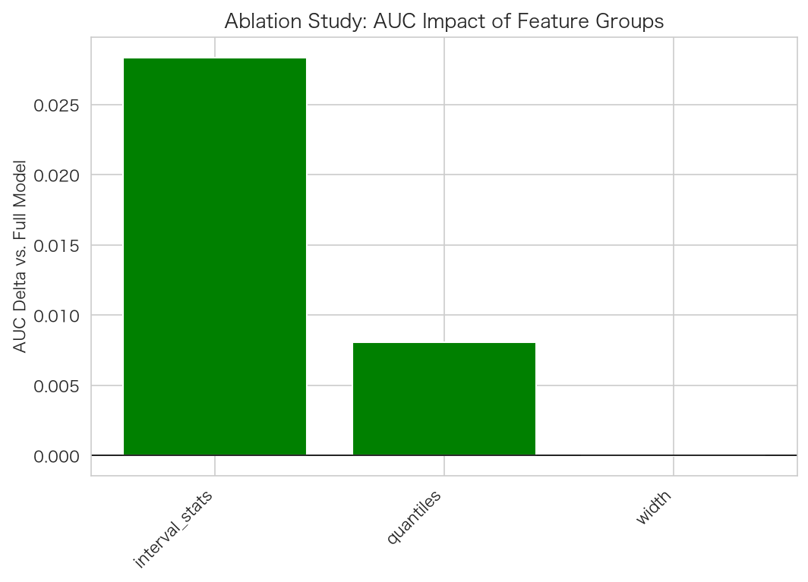

# 区间型财务数据与企业风险识别

**一个可复现的预测研究实验：历史分布特征是否比当期点特征更有用？**

[在线交互报告](https://dev-belly.github.io/interval-financial-risk/) · [离线 HTML](docs/demo/index.html) · [逐折指标](docs/demo/rolling_metrics.csv) · [复现配置与环境](docs/demo/run_manifest.json)

项目将营收增速、利润率、经营现金流和波动率扩展为过去四个季度的分布特征，比较固定算法下的特征增量，并检查时间稳定性、概率校准、消融和标签预测区间覆盖。

**当前公开示例完全使用合成数据。此次实验中，加入区间特征没有改善 AUC。** 这一负结果与源代码、逐条测试预测一起保留，不将其包装为真实企业违约预测或因果发现。

## 本次实测结果

配置：[config/config.yaml](config/config.yaml)。300 家模拟公司 × 16 个季度，2019-03 至 2022-12，共 4,800 行，整体正例率 12%，随机种子 202608。三个扩展窗口测试折各有 600 行，共 1,800 条独立于对应训练窗口的测试记录。点模型使用 4 个特征，区间模型使用 48 个特征。

以下为**测试折等权均值**；AUC 的 ± 为折间标准差，不是置信区间。PR-AUC 使用 average precision，Brier 越低越好。

| 模型 | 特征 | AUC | PR-AUC | Brier |
|---|---|---:|---:|---:|
| Logistic Baseline | 当期点特征 | **0.7243 ± 0.0235** | **0.3441** | 0.2033 |
| Logistic + Interval | 点 + 区间 | 0.6857 ± 0.0343 | 0.3105 | 0.2179 |
| Elastic Net | 点 + 区间 | 0.6862 ± 0.0346 | 0.3080 | 0.2177 |
| XGBoost | 点 + 区间 | 0.6781 ± 0.0356 | 0.3021 | **0.1469** |
| LightGBM | 点 + 区间 | 0.6687 ± 0.0345 | 0.3251 | 0.1541 |

同一逻辑回归算法中，加入区间特征使平均 AUC 下降 **0.0386**。树模型的 Brier 更低，但这不意味着其排序能力更强。模型均使用类别权重，输出概率没有再校准，需结合校准曲线阅读。



**最后测试折的消融**固定使用区间逻辑回归，各变体重新训练：全部特征 AUC 0.6981；移除全部区间特征后为 0.7265（Δ +0.0283）；移除分位数后为 0.7062；移除宽度后为 0.6981。这一结果同样不支持“区间越复杂越好”。[原始消融表](docs/demo/ablation_study.csv)



**标签预测区间**使用预先指定的区间逻辑回归，单独按时间分为 2,700 行训练、900 行校准、1,200 行测试。名义覆盖 90%，经验覆盖 **92.25%**，平均区间宽度 **0.965**。区间几乎覆盖整个 [0,1]，高覆盖伴随很低的辨别力；这不是风险概率的置信区间。[覆盖率与宽度](docs/demo/conformal_coverage.csv)

## 复现

```bash
python3 -m venv .venv
source .venv/bin/activate
pip install -r requirements.txt
python scripts/run_experiment.py --config config/config.yaml
python scripts/export_demo.py --config config/config.yaml
python scripts/verify_demo.py
```

- 完整默认实验输出到 `outputs/`；导出程序仅允许合成数据，并核对完整配置与源码哈希，再更新 `docs/demo/`。
- `docs/demo/index.html` 内嵌 Plotly.js，下载后可直接离线打开，不需要 CDN 或运行 Python 服务。
- `config/full_benchmark.yaml` 是保留历史文件名的**小型烟雾配置**（100 家公司、12 季度、3 个模型），不是更大规模调参实验。
- 本次环境为 Python 3.12.13；依赖版本、数据摘要与源码哈希见 [run_manifest.json](docs/demo/run_manifest.json)。跨依赖版本不承诺逐位相同。

```bash
pytest
ruff check .
```

当前 15 项测试覆盖时间索引、训练数据预处理、合成数据复现与缓存、区间宽度、完整消融、conformal 阶次、验证集模型选择和 Elastic Net 随机种子。

## 如何核对结果

| 产物 | 用途 |
|---|---|
| [predictions.csv](docs/demo/predictions.csv) | 每个模型、测试折、公司和季度的真实标签与预测概率，可独立复算指标 |
| [model_summary.csv](docs/demo/model_summary.csv) | 各折指标均值及标准差 |
| [fold_splits.csv](docs/demo/fold_splits.csv) | 训练、验证、测试的日期、行数与正例数 |
| [validation_metrics.csv](docs/demo/validation_metrics.csv) | 诊断模型选择的依据 |
| [config.yaml](docs/demo/config.yaml) | 本次运行的原始配置 |
| [run_manifest.json](docs/demo/run_manifest.json) | 配置快照、依赖版本、数据与源码哈希 |

诊断模型按**验证集平均 AUC**选择，最后测试折不参与选择；本次为点逻辑回归。消融和 conformal 使用预先固定的区间逻辑回归，避免点模型获胜时消融变成空操作，以及用校准/测试分数挑选 conformal 模型。交互 ROC/PR 图合并各折测试预测，其数值与表中的逐折平均有不同的统计口径。

## 方法边界

- **合成标签**由预设的同期特征、行业/时间项及噪声生成；不是实际违约事件，也不是未来若干季度的违约标签。生成过程使用全样本阈值控制正例率。
- **时间顺序**按合成 `report_date` 切分。区间包含当前季度与此前三个季度；真实财务发布日期、可得时间、重述和标签成熟期尚未验证。
- **公司相关性**：训练和测试中存在同一公司的不同季度；没有进行未见公司外推。折间标准差不处理公司聚类依赖。
- **校准与覆盖**：类别权重会改变概率尺度。Conformal 经典覆盖结论要求可交换性，金融漂移及公司相关性使本项目只能报告经验诊断。
- **正交化回归**只控制行业；随机行交叉拟合和常规 OLS 区间未做公司聚类修正，不构成因果效应或稳健显著性证据。
- **超参优化**代码存在，但默认示例关闭。当前 Optuna 内层使用随机分层折，不应宣称为嵌套时间序列验证。
- **真实数据**仅提供本地 CSV/Parquet 加载入口；公开采集、真实标签构建与市场实证仍待完成。

## 实现

Python 3.11+；Pandas / NumPy / PyArrow；scikit-learn、XGBoost、LightGBM；Optuna（可选调参路径）；Pydantic / YAML 配置；Plotly、Matplotlib、Seaborn；pytest / Ruff。仓库未实现 CatBoost、Hydra、Great Expectations、DVC 或自动金融数据接口。

```text
config/             实验参数
src/data/           合成生成器与本地加载
src/features/       区间工程、训练集插补与标准化
src/models/         逻辑回归、Elastic Net、树模型
src/evaluation/     时间验证、指标、消融与覆盖诊断
src/visualization/  静态图和离线交互报告
scripts/            运行、导出、独立核验
tests/              回归测试
docs/demo/          已运行的公开合成示例
```

独立研究项目。代码采用 [MIT License](LICENSE)。
